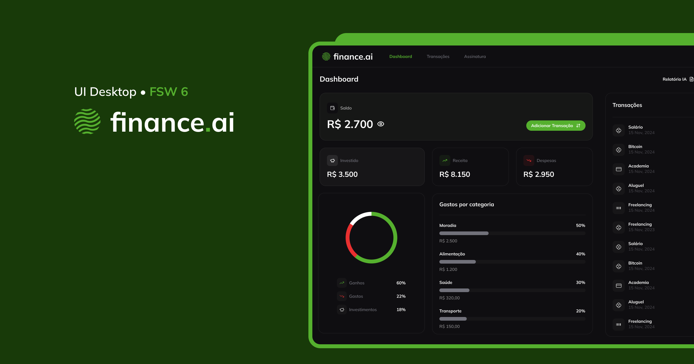
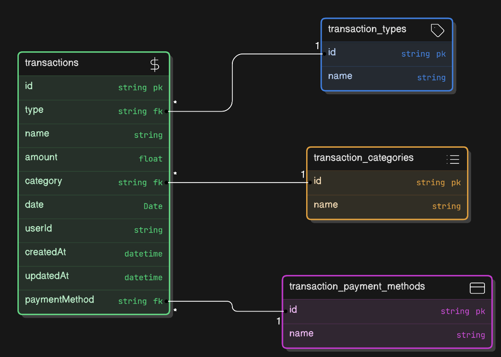

# Finance.ai
Aplicação web criada na Full Stack Week utilizando dados para inserção de transações e inteligência artifical para análise.

## Tecnologias
- [NextJS](https://nextjs.org/)
- [TailwindCSS](https://tailwindcss.com/)
- [Shadcn/UI](https://ui.shadcn.com/)
- [ClerkAuth](https://clerk.com/)
- [PrismaORM](https://www.prisma.io/)
- [PostgreSQL / Neon](https://neon.tech/)
- [Eraser.io](https://www.eraser.io/)

## Como iniciar

Primeiro, execute sua aplicação utilizando:

```bash
npm run dev
# ou
yarn dev
```

Abra [http://localhost:3000](http://localhost:3000)

## Detalhes do projeto

### Diagrama


